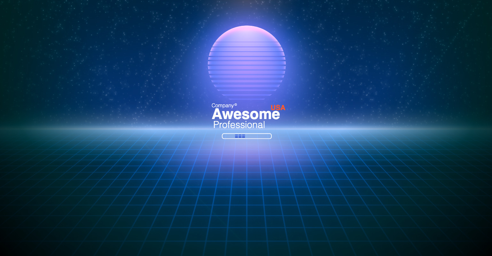

# awesome-retro-loading
A retro-futuristic vaporwave loading screen featuring animated neon grids, skyline silhouettes, and shimmering stars in an 80s-inspired night sky. Designed with pure HTML & CSS — no JS frameworks, just nostalgic vibes.
vaporwave, 80s, neon grid, retro-futuristic, css animation, skyline, stars, html css only, infinite grid, miami nights, synthwave, retro ui, loading screen, nostalgic web, pixel sunset
## 🌌 Preview

## !important Note

You don’t need to waste hours chasing that “perfect retro look” anymore. This file gives you a plug-and-play vaporwave loading screen so you can stop obsessing over the visuals and focus on building your actual project.

Retro aesthetics are cool — but they’re also just a fad. They won’t make your product better. They won’t make you richer. So stop tweaking neon gradients for hours, bro. Drop this in, move on, and build something that matters.
